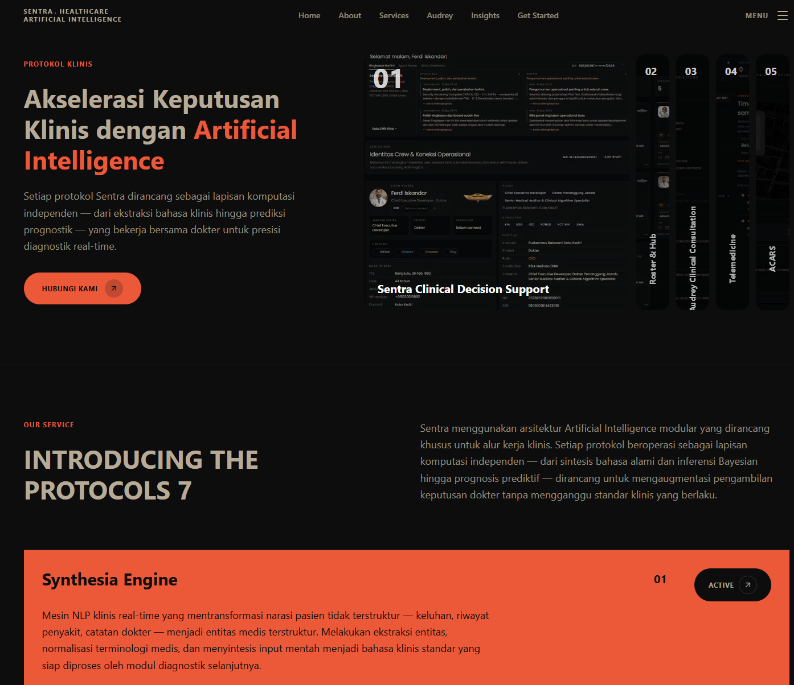

<!-- Architected and built by the one and only Classy. -->

<div align="center">



# Sentra Artificial Intelligence

### _Intelligent Clinical Infrastructure for Indonesian Puskesmas_

[](https://github.com/Classy/sentra-landing/actions/workflows/ci.yml)
[](https://nextjs.org/)
[](https://react.dev/)
[](https://www.typescriptlang.org/)
[](https://tailwindcss.com/)
[](https://www.framer.com/motion/)
[](https://gsap.com/)
[](https://railway.app/)
[](./LICENSE)

<br/>

> _"Our technology exists for one purpose only: to honor the sacrifice of
> healthcare workers_ _by giving them better tools than the problems they
> face."_
>
> — **Classy**, Principal Architect

<br/>

**[Live Demo](https://github.com/Classy/abyss)** &nbsp;·&nbsp;
**[Report a Bug](https://github.com/Classy/abyss/issues)** &nbsp;·&nbsp;
**[Request a Feature](https://github.com/Classy/abyss/issues)**

</div>

---

## Table of Contents

1. [Overview](#1-overview)
2. [Product Suite](#2-product-suite)
3. [AI Engine Modules](#3-ai-engine-modules)
4. [Architecture](#4-architecture)
5. [Tech Stack](#5-tech-stack)
6. [Page Structure — 15 Components](#6-page-structure--15-components)
7. [Component Reference](#7-component-reference)
8. [UI Primitives](#8-ui-primitives)
9. [Project Structure](#9-project-structure)
10. [Design System](#10-design-system)
11. [Security Configuration](#11-security-configuration)
12. [CI/CD Pipeline](#12-cicd-pipeline)
13. [Prerequisites](#13-prerequisites)
14. [Installation](#14-installation)
15. [Configuration](#15-configuration)
16. [Development](#16-development)
17. [Build & Production](#17-build--production)
18. [Testing](#18-testing)
19. [Deployment](#19-deployment)
20. [Roadmap](#20-roadmap)
21. [Contributing](#21-contributing)
22. [Changelog](#22-changelog)
23. [License](#23-license)
24. [Contact](#24-contact)

---

## 1. Overview

**Sentra AI** is a production-grade marketing and product landing site that
presents Sentra's intelligent clinical infrastructure to decision-makers at
Indonesian Community Health Centers (**Puskesmas / PKM**). It is built with the
latest generation of web technologies and delivers a visually rich,
animation-driven experience across all screen sizes.

The site communicates a single thesis: fragmented patient data, manual
administrative burden, and slow clinical decision-making are solvable problems —
and Sentra's AI engine suite is the solution engineered specifically for
Indonesia's national healthcare ecosystem (SATUSEHAT, BPJS P-Care, SIK Dinkes,
e-Puskesmas).

### What Makes This Site Distinctive

This is not a template-based landing page. Every section contains live,
functioning UI demonstrations of the actual product — including an interactive
multi-step clinical simulation (`SentraSim`), a real-time AI conversation demo
(`Audrey`), a longitudinal patient trajectory visualiser (`ClinicalTrajectory`),
and statistical proof cards (`SentraBentoCards`). Visitors experience the
product before signing up.

### Target Audience

| Audience         | Primary Message                                                     |
| ---------------- | ------------------------------------------------------------------- |
| Kepala Puskesmas | Operational ROI — 40% fewer misdiagnoses, 3× faster decisions       |
| Dokter Umum      | Clinical decision support that reduces cognitive load               |
| Tenaga Kesehatan | AI assistance that handles administrative tasks automatically       |
| Dinas Kesehatan  | System integration with SATUSEHAT, BPJS, and SIK national platforms |

---

## 2. Product Suite

### SentraSim — Sequential Clinical Simulation Engine

An interactive AI-driven platform that walks medical staff through branching
patient scenarios in real time. The landing page demo
(`components/SentraSim.tsx`) is a fully functioning simulation with 21+ React
state hooks orchestrating a sequential asynchronous clinical workflow.

**Demonstrated capabilities in the landing demo:**

- NLP-driven anamnesis parsing — structured extraction of chief complaint,
  history, and risk factors
- Physical examination matrix with per-organ alert flagging
- Lab recommendation engine with contextual prioritisation
- Structured lab result interpretation with critical value alerts
- Differential diagnosis generation with severity stratification (ringan /
  sedang / berat)
- Clinical treatment plan with urgency-tiered action items
- Prognostic scoring with confidence intervals

### Audrey — AI Healthcare Assistant

Audrey is Sentra's conversational AI assistant purpose-built for the Indonesian
clinical context. The Hero section (`components/Hero.tsx`) demonstrates a
four-phase live conversation: Puskesmas consultation, Specialist (Sp.JP)
referral, EKG confirmation, and Emergency Department handoff.

**Key capabilities:**

- Natural language clinical Q&A in Bahasa Indonesia
- BPJS claim guidance and ICD code cross-reference
- Specialist referral pathway orchestration
- Integration awareness of Kemenkes RI data sources
- Real-time confidence scoring on clinical recommendations

### Clinical Trajectory — Longitudinal Patient Intelligence

The `ClinicalTrajectory` and `ClinicalPrognosis` components visualise a
patient's multi-visit vital trend, risk stratification, and predictive outcomes
— based on real clinical parameters (SBP, DBP, HR, RR, Temperature, GDS).

**Demonstrated analytics in the landing demo:**

- Trend line across four clinical visits with delta annotations
- Six vital parameters with risk levels (low / moderate / high / critical)
- Acute risk probability bars (Krisis Hipertensi 72%, Stroke/ACS 58%)
- Prognostic confidence interval with timeline projection

### PKM Dashboard — Integrated Operations Platform

The full product described across the Services and Showcase sections:

| Module                                  | Description                                                                                                     |
| --------------------------------------- | --------------------------------------------------------------------------------------------------------------- |
| **Synthesia Engine**                    | Real-time clinical NLP — transforms unstructured patient narratives into structured medical entities            |
| **Bayesian Algorithm**                  | Posterior probability engine for differential diagnosis with confidence intervals                               |
| **OCR**                                 | Medical-grade document intelligence — extracts structured data from lab results, radiographs, and prescriptions |
| **AI Pharma**                           | Pharmacovigilance layer — real-time drug interaction, allergy, and contraindication checking                    |
| **Smart Referral & Auto Documentation** | Automated referral letters, discharge summaries, and clinical notes — reduces admin load by up to 40%           |
| **Clinical Prognosis**                  | Predictive outcome modelling — synthesises trajectory data, comorbidities, and therapy response patterns        |

---

## 3. AI Engine Modules

The Services section presents seven distinct AI engine modules that compose the
complete Sentra intelligence stack. Each is described below exactly as it
appears in `components/Services.tsx`:

| #   | Module                                  | Core Function                                                                                                                                                     |
| --- | --------------------------------------- | ----------------------------------------------------------------------------------------------------------------------------------------------------------------- |
| 01  | **Synthesia Engine**                    | Real-time clinical NLP — entity extraction, terminology normalisation, structured output generation from unstructured patient narratives                          |
| 02  | **Bayesian Algorithm**                  | Differential diagnosis via posterior probability — symptom likelihood ratios × clinical prevalence × patient risk factors, ordered with confidence intervals      |
| 03  | **Clinical Trajectory**                 | Longitudinal disease progression mapping — anomaly detection, deterioration window prediction, precision-timed intervention support                               |
| 04  | **OCR**                                 | Medical document extraction — lab results, radiographs, prescriptions — forensic-grade accuracy with per-field confidence scores, eliminates manual transcription |
| 05  | **AI Pharma**                           | Pharmacovigilance automation — drug-drug interaction database, allergy cross-reference, comorbidity contraindications, real-time pre-prescription safety alerts   |
| 06  | **Smart Referral & Auto Documentation** | Automated standardised referral letters, discharge summaries, and visit notes — up to 40% reduction in administrative burden                                      |
| 07  | **Clinical Prognosis**                  | Predictive outcome modelling — risk-stratified timelines, intervention impact projections, evidence-based prognostic assessment                                   |

---

## 4. Architecture

### Landing Site Architecture

This repository contains the **public-facing marketing site only**. The home
page (`app/page.tsx`) composes **15** React components in one scroll; other App
Router routes include `/story`, `/insights`, `/privacy`, and `/terms`.

```
Browser
  │
  └─▶  Next.js 16 App Router (Client-side)
         │
         ├── app/layout.tsx        — Root layout: fonts, metadata, html lang="id"
         ├── app/page.tsx          — Main page: 15 components in render order
         ├── app/story/page.tsx    — Our Story standalone page (scroll-reveal)
         └── app/globals.css       — Tailwind v4 @theme + 88 CSS custom properties
```

### Full Platform Architecture (Product Context)

The landing site describes a broader platform. The diagram below reflects the
complete system as documented in [`ARCHITECTURE.md`](./ARCHITECTURE.md) (detail)
and [`docs/architecture.md`](./docs/architecture.md) (overview):

```
┌──────────────────────────────────────────────────────────────────┐
│                      SENTRA AI PLATFORM                          │
│                                                                  │
│  ┌─────────────────┐  ┌──────────────┐  ┌────────────────────┐  │
│  │  Next.js 16     │  │   FastAPI    │  │  External Systems  │  │
│  │  App Router     │  │   Backend    │  │                    │  │
│  │                 │  │              │  │  SATUSEHAT         │  │
│  │  Marketing UI   │  │  PostgreSQL  │  │  BPJS P-Care       │  │
│  │  Framer Motion  │  │  + Prisma    │  │  SIK Dinkes        │  │
│  │  GSAP           │  │              │  │  e-Puskesmas       │  │
│  └─────────────────┘  │  Redis Cache │  └────────────────────┘  │
│                       │              │                           │
│                       │  WebSocket   │  ┌────────────────────┐  │
│                       │  (ACARS)     │  │  Security Layer    │  │
│                       └──────────────┘  │  AES-256           │  │
│                                         │  RBAC              │  │
│                                         │  Rate Limiting     │  │
│                                         │  Audit Logging     │  │
│                                         └────────────────────┘  │
└──────────────────────────────────────────────────────────────────┘
```

### Monorepo Context

On disk this app lives at `apps/healthcare/sentra-main` under `abyss-monorepo`
(polyrepo layout: the monorepo root may gitignore `apps/`). It is a standalone
Next.js package with its own `package.json`.

---

## 5. Tech Stack

### Production Dependencies

| Package                | Version  | Purpose                                                           |
| ---------------------- | -------- | ----------------------------------------------------------------- |
| `next`                 | ^16.1.6  | App Router framework — SSR, routing, image optimisation           |
| `react`                | ^19.2.4  | UI rendering, concurrent features                                 |
| `react-dom`            | ^19.2.4  | DOM renderer                                                      |
| `framer-motion`        | ^12.35.2 | Declarative animations — viewport triggers, AnimatePresence       |
| `gsap`                 | ^3.14.2  | Imperative animations — kinetic navigation overlay                |
| `tailwindcss`          | ^4.2.1   | CSS-native utility framework (v4, `@theme` block, no config file) |
| `@tailwindcss/postcss` | ^4.2.1   | PostCSS integration for Tailwind v4                               |
| `postcss`              | ^8.5.8   | CSS transformation pipeline                                       |
| `autoprefixer`         | ^10.4.27 | Vendor prefix injection                                           |
| `lucide-react`         | ^0.577.0 | Icon library (ArrowUpRight, Menu, X, clinical and medical icons)  |
| `clsx`                 | ^2.1.1   | Conditional class name construction                               |
| `tailwind-merge`       | ^3.5.0   | Tailwind class conflict resolution                                |

### Development Dependencies

| Package              | Version  | Purpose                                  |
| -------------------- | -------- | ---------------------------------------- |
| `typescript`         | ^5.9.3   | Static typing — strict mode enabled      |
| `eslint`             | ^9.39.4  | Linting — ESLint 9 flat config           |
| `eslint-config-next` | ^16.1.6  | Next.js ESLint ruleset (core-web-vitals) |
| `@types/node`        | ^25.4.0  | Node.js type definitions                 |
| `@types/react`       | ^19.2.14 | React 19 type definitions                |
| `@types/react-dom`   | ^19.2.3  | React DOM type definitions               |

### Runtime Environment

| Requirement                  | Value                                      |
| ---------------------------- | ------------------------------------------ |
| Node.js                      | ≥ 22 LTS                                   |
| npm                          | ≥ 10                                       |
| Package module type          | ESM (`"type": "module"` in `package.json`) |
| TypeScript compile target    | ES2022                                     |
| TypeScript module resolution | `bundler`                                  |

---

## 6. Page Structure — 15 Components

The main page (`app/page.tsx`) composes **15 components** in this exact order:

```
app/page.tsx
│
├── <Navbar />               — Scroll-aware navigation bar + full-screen GSAP kinetic menu
├── <Hero />                 — Four-phase Audrey AI conversation demo (auto-advancing)
├── <ProjectSlider />        — Horizontal scroll showcase of featured projects
├── <About />                — Mission statement and Human-AI convergence overview
├── <Clients />              — Partner organisation logos
├── <SentraSim />            — Live multi-step clinical simulation (most complex component)
├── <Showcase />             — Product screenshots and bento statistic cards
├── <Services />             — Seven AI engine modules with interactive accordion UI
├── <Audrey />               — AI assistant feature spotlight with animated conversation
├── <ClinicalTrajectory />   — Longitudinal patient vital trend and risk prediction
├── <News />                 — Latest updates and announcements
├── <ScrollGallery />        — Immersive scroll-driven visual case studies
├── <FAQ />                  — Accordion FAQ
├── <CTA />                  — Conversion call-to-action with contact links
└── <Footer />               — Navigation links, legal text, brand signature
```

The `/story` route (`app/story/page.tsx`) is a separate standalone page that
renders the full company narrative with scroll-reveal animations and an
extensive icon set from Lucide React.

---

## 7. Component Reference

All components follow a consistent pattern:

- `"use client"` directive at the top of every file
- Single default export
- Framer Motion for all declarative animations
- GSAP for imperative timeline animations (Navbar overlay only)
- Lucide React for all icons
- `cn()` utility for conditional class composition
- No cross-component shared state — local `useState` only

---

### Navbar (`components/Navbar.tsx`)

Scroll-aware navigation bar with a collapsible full-screen overlay for mobile.

**Behaviour:**

- Transparent at the top of the page; applies a background style after
  `window.scrollY > 20`
- Mobile hamburger (`Menu` icon) opens the `SentraKineticNav` overlay
- Opening the overlay locks body scroll via
  `document.body.style.overflow = "hidden"`
- Closing the overlay restores scroll and cleans up on unmount
- Navigation links sourced from `lib/site-links.ts`

**Nav links rendered:** Home, About, Services, Audrey, Insights

---

### Hero (`components/Hero.tsx`)

Full-screen hero section demonstrating Audrey AI in a live clinical
conversation.

**Four-phase auto-advancing demo:**

| Phase | Header Label            | Colour           | Scenario                            |
| ----- | ----------------------- | ---------------- | ----------------------------------- |
| 1     | Audrey · Puskesmas      | `#C4956A` amber  | Initial Puskesmas consultation      |
| 2     | Audrey · Konsul Sp.JP   | `#6B9B8A` teal   | Cardiology specialist referral      |
| 3     | Audrey · Konfirmasi EKG | `#C4956A` amber  | EKG confirmation and interpretation |
| 4     | Audrey · Rujukan RS     | `#eb5939` accent | Emergency department handoff        |

**Phase timings:** transitions occur at `9500ms`, `16500ms`, `24000ms`

**Chat bubble styles:**

- `audreyBubble` — Audrey AI responses (amber-tinted rounded-xl)
- `dokterBubble` — Doctor messages (foreground-tinted)
- `tealBubble` — Specialist channel messages (teal-tinted)

Typography: Caveat (Google Font, weights 500 and 700) for handwritten annotation
style.

---

### SentraSim (`components/SentraSim.tsx`)

The most complex component in the codebase — approximately 22 KB, 21+ `useState`
hooks, fully sequential async clinical simulation with a 12-type TypeScript
system.

**Custom TypeScript types:**

| Type                   | Shape                                 | Purpose                                                       |
| ---------------------- | ------------------------------------- | ------------------------------------------------------------- |
| `VitalSign`            | `label, value, unit, critical?`       | Individual vital sign data point                              |
| `EntityTag`            | `text, type`                          | NLP-extracted medical entity                                  |
| `AnomalyTag`           | `EntityTag + tone`                    | Anomaly with `"critical" \| "warning" \| "default"` colouring |
| `LabRecommendation`    | `name, status`                        | Recommended laboratory test                                   |
| `LabResult`            | `name, value, interpretation, alert?` | Interpreted laboratory result                                 |
| `TrajectoryPoint`      | `label, value`                        | Single trajectory chart data point                            |
| `TrajectoryMedication` | `name, dosage`                        | Prescribed medication with dosage                             |
| `PhysicalExamRow`      | `organ, result, alert?`               | Per-organ physical examination finding                        |
| `ClinicalReasoning`    | `text, tone`                          | Reasoning item with `"primary" \| "warning" \| "muted"`       |
| `TreatmentPlanItem`    | `action, tone`                        | Treatment item with `"urgent" \| "primary" \| "supportive"`   |
| `HeaderTone`           | `"muted" \| "accent"`                 | Controls section header colour                                |
| `HistoryPhase`         | `"idle" \| "loading" \| "ready"`      | Patient history loading state machine                         |

**Simulation phases (executed sequentially, async):**

1. **Anamnesis** — chief complaint, medical history, NLP entity tag extraction
2. **Physical Examination** — per-organ findings matrix with critical value
   alerts
3. **Lab Recommendations** — prioritised test ordering with justification
4. **Lab Results** — interpreted values with alert thresholds and clinical
   commentary
5. **Differential Diagnosis** — severity-stratified candidates (ringan / sedang
   / berat)
6. **Treatment Plan** — urgency-tiered actions (urgent / primary / supportive)
7. **Prognosis** — confidence interval scoring with trajectory projection

The `TextScramble` UI primitive drives the character-level text reveal
animations during phase transitions, simulating live AI processing.

The `[data-sentra-sim]` attribute on the wrapper div scopes a CSS
`box-sizing: border-box` reset to this component only, preventing interference
with the global layout.

---

### Audrey (`components/Audrey.tsx`)

Feature spotlight section for the Audrey AI assistant with a live animated
conversation demo.

**Custom TypeScript types:**

| Type                  | Shape                                                             |
| --------------------- | ----------------------------------------------------------------- |
| `ConversationMessage` | `id, role: "user" \| "audrey", text, delay, isThinking?, badges?` |
| `MessageBadge`        | `label, accent?, confidence?, value?`                             |
| `FeatureItem`         | `id, title, desc`                                                 |

**Behaviour:**

- Uses `useInView` from Framer Motion — conversation animation triggers only
  when the section enters the viewport (lazy start)
- `isThinking` messages render a typing indicator before the actual response
- `MessageBadge` items display inline confidence scores and diagnostic values
  within messages
- The Audrey colour system (`AUD` constant object) provides all token aliases:
  `amber`, `amberMuted`, `amberFaint`, `teal`, `tealFaint`, `bubbleBackground`,
  etc.

---

### ClinicalTrajectory (`components/ClinicalTrajectory.tsx`)

Longitudinal vital trend visualisation with risk prediction — demonstrates
Sentra's multi-visit patient intelligence to non-technical healthcare
decision-makers.

**Demo patient data — four clinical visits:**

| Visit | SBP (mmHg) | DBP (mmHg) | HR (bpm) | GDS (mg/dL) |
| ----- | ---------- | ---------- | -------- | ----------- |
| 12/09 | 140        | 88         | 78       | 210         |
| 15/10 | 148        | 92         | 82       | 238         |
| 22/11 | 155        | 94         | 88       | 262         |
| TODAY | 168        | 98         | 92       | 284         |

**Six vital parameters with risk classification:**

| Parameter | Value     | Risk     | Clinical Note                    |
| --------- | --------- | -------- | -------------------------------- |
| SBP       | 168 mmHg  | high     | Trend +28 mmHg across 3 visits   |
| DBP       | 98 mmHg   | moderate | Approaching hypertension stage 2 |
| HR        | 92 bpm    | low      | Within normal range              |
| RR        | 22 x/min  | moderate | Slightly above normal            |
| TEMP      | 36.8 °C   | low      | Normal                           |
| GDS       | 284 mg/dL | critical | Significant hyperglycaemia       |

**Acute risk probabilities displayed:**

- Krisis Hipertensi: **72%**
- Stroke / ACS: **58%**

Renders `ClinicalPrognosis` (`components/ClinicalPrognosis.tsx`) as a child
sub-component for the prognostic confidence interval panel.

---

### Services (`components/Services.tsx`)

Interactive accordion catalogue of seven AI engine modules. Clicking a service
ID expands its detail panel; only one is active at a time.

Default active: `"01"` — Synthesia Engine

Transitions use `AnimatePresence` with a conditional render pattern. The
`activeId` state is `string | null`, allowing full collapse if needed.

---

### About (`components/About.tsx`)

Three-column grid layout on large screens (`lg:grid-cols-[1fr_auto_1fr]`):

- Left column: section label + heading with accent-coloured key phrase
- Centre column: vertical `1px` divider (hidden on mobile)
- Right column: descriptive content paragraphs

Section anchor ID: `id="about"`

Content describes Sentra's Human-AI Convergence Architecture and mission to
serve frontline healthcare workers in Indonesian Puskesmas.

---

## 8. UI Primitives

Reusable building blocks in `components/ui/`, consumed by section components.

### `SentraKineticNav` (`ui/sentra-kinetic-nav.tsx`)

Full-screen navigation overlay driven by **GSAP** (independent of Framer
Motion).

**Menu items:**

| Label     | Route       | Shape ID |
| --------- | ----------- | -------- |
| Our Story | `/story`    | `"1"`    |
| Services  | `#services` | `"2"`    |
| Audrey    | `#audrey`   | `"3"`    |
| Insights  | `#insights` | `"4"`    |
| Contact   | `#contact`  | `"5"`    |

**Props:** `isOpen: boolean`, `onClose: () => void`

GSAP timelines control the enter and exit transitions. The `X` icon (Lucide)
serves as the close button. Each menu item has a `shape` identifier for per-item
animation configuration.

---

### `SentraBentoCards` (`ui/sentra-bento-cards.tsx`)

Four proof-of-value statistic cards used in the Showcase section:

| Stat      | Title                      |
| --------- | -------------------------- |
| **40%**   | Reduksi Misdiagnosis       |
| **3×**    | Kecepatan Keputusan Klinis |
| **97.2%** | Akurasi Triase Darurat     |
| **10 Th** | Retensi Audit Trail        |

Uses the `cn()` utility for all conditional class composition.

---

### `ImmersiveScrollGallery` (`ui/immersive-scroll-gallery.tsx`)

Scroll-driven gallery rendered inside the `ScrollGallery` section. Responds to
page scroll position to advance through case-study images with a parallax
immersive effect.

---

### `InteractiveImageAccordion` (`ui/interactive-image-accordion.tsx`)

Hover-and-click accordion for product screenshots used in the Showcase section.
Expands an image panel on interaction.

---

### `TextScramble` (`ui/text-scramble.tsx`)

Character-level text scramble animation component. Used exclusively by
`SentraSim`. Resolves a scrambled character sequence to a target string —
simulates live AI text generation output. Consumed as `<TextScramble />` with a
`text` prop.

---

### `MagneticText` (`ui/morphing-cursor.tsx`)

Magnetic cursor interaction component.

**Props:** `text: string`, `hoverText?: string`, `className?: string`

On hover, text morphs from `text` to `hoverText` with a magnetic cursor-follow
effect implemented via `useRef` + `mousemove` event tracking and CSS transform.

---

## 9. Project Structure

```
sentra-landing/
│
├── app/                               # Next.js App Router root
│   ├── globals.css                    # Tailwind v4 @theme — 88 CSS tokens across 6 groups
│   ├── layout.tsx                     # Root layout: Plus Jakarta Sans + Inter, html lang="id"
│   ├── page.tsx                       # Home — 15 components in sequence
│   └── story/
│       └── page.tsx                   # /story — Our Story standalone page
│
├── components/                        # Section components (one file per section)
│   ├── Navbar.tsx                     # Scroll-aware nav + mobile menu
│   ├── Hero.tsx                       # 4-phase Audrey chat demo with timed transitions
│   ├── ProjectSlider.tsx              # Horizontal project scroll
│   ├── About.tsx                      # Mission, Human-AI convergence narrative
│   ├── Clients.tsx                    # Partner logos
│   ├── SentraSim.tsx                  # Clinical simulation (~57KB, 21+ useState)
│   ├── Showcase.tsx                   # Product screenshots + bento stats
│   ├── Services.tsx                   # 7 AI engine accordion
│   ├── Audrey.tsx                     # AI assistant feature demo
│   ├── ClinicalTrajectory.tsx         # Longitudinal vital trend + risk prediction
│   ├── ClinicalPrognosis.tsx          # Used inside ClinicalTrajectory (not top-level on `/`)
│   ├── News.tsx                       # Updates and announcements
│   ├── ScrollGallery.tsx              # Scroll-driven gallery
│   ├── FAQ.tsx                        # Accordion FAQ
│   ├── CTA.tsx                        # Conversion call-to-action
│   ├── Footer.tsx                     # Footer
│   └── ui/                            # Reusable UI primitives
│       ├── sentra-kinetic-nav.tsx     # GSAP full-screen menu overlay
│       ├── sentra-bento-cards.tsx     # Statistic proof cards
│       ├── immersive-scroll-gallery.tsx
│       ├── interactive-image-accordion.tsx
│       ├── text-scramble.tsx          # AI-style character scramble
│       └── morphing-cursor.tsx        # MagneticText cursor effect
│
├── lib/
│   ├── site-links.ts                  # Centralised anchor link constants
│   └── utils.ts                       # cn() — clsx + tailwind-merge
│
├── public/                            # Static assets
│   ├── hero.jpg
│   └── *.jpg / *.png
│
├── docs/
│   ├── architecture.md                # Full architecture documentation
│   └── adr-001-nextjs-app-router.md   # Architecture Decision Record
│
├── .github/
│   ├── workflows/
│   │   ├── ci.yml                     # Lint + Build (push / PR)
│   │   ├── cd.yml                     # Deploy to production (main only)
│   │   └── security.yml               # npm audit (scheduled + main)
│   ├── ISSUE_TEMPLATE/
│   │   ├── bug_report.md
│   │   └── feature_request.md
│   └── PULL_REQUEST_TEMPLATE.md
│
├── scripts/
│   └── setup.sh                       # Developer environment bootstrap
│
├── .editorconfig                      # Indent size, charset, EOL, trim trailing whitespace
├── .env.example                       # Environment variable reference
├── .gitattributes                     # LF normalisation + diff drivers
├── .gitignore                         # Node, Next.js, OS and IDE exclusions
├── .railwayignore                     # Railway build exclusions
├── eslint.config.mjs                  # ESLint 9 flat config
├── next.config.mjs                    # Next.js: Turbopack, image domains, security headers
├── package.json                       # ESM, scripts, dependencies
├── postcss.config.mjs                 # @tailwindcss/postcss
├── tsconfig.json                      # Strict TS, ES2022, bundler resolution
├── CHANGELOG.md                       # Keep a Changelog — v1.0.0 + v1.1.0
├── CLAUDE.md                          # Claude Code instructions
├── CODE_OF_CONDUCT.md                 # Contributor conduct standards
├── COMMIT_CONVENTION.md               # Conventional Commits specification
├── CONTRIBUTING.md                    # Contribution workflow
├── LICENSE                            # ISC — Copyright 2026 Classy
├── REVIEW_REPORT.md                   # Comprehensive audit report (2026-03-11)
└── SECURITY.md                        # Responsible disclosure policy
```

---

## 10. Design System

All design tokens are defined in `app/globals.css`. There is no
`tailwind.config.ts`. The `@theme` block maps Tailwind utility classes to CSS
custom properties.

### Tailwind Theme Mapping

```css
@theme {
  --color-background: var(--sentra-bg); /* bg-background */
  --color-foreground: var(--sentra-fg); /* text-foreground */
  --color-accent: var(--sentra-accent); /* text-accent, bg-accent */
  --color-muted: var(--sentra-muted-text); /* text-muted */

  --font-sans: var(--font-jakarta), ui-sans-serif, system-ui, sans-serif;
  --font-inter: var(--font-inter), ui-sans-serif, system-ui, sans-serif;
}
```

### Core Palette

| CSS Variable           | Hex Value | Tailwind Usage             |
| ---------------------- | --------- | -------------------------- |
| `--sentra-bg`          | `#0d0d0d` | `bg-background`            |
| `--sentra-fg`          | `#b7ab98` | `text-foreground`          |
| `--sentra-accent`      | `#eb5939` | `text-accent`, `bg-accent` |
| `--sentra-white`       | `#ffffff` | Direct reference           |
| `--sentra-canvas`      | `#1C1B1A` | Elevated card surfaces     |
| `--sentra-canvas-dark` | `#141311` | Deep card surfaces         |
| `--sentra-panel-1`     | `#111110` | Darkest panel              |
| `--sentra-panel-2`     | `#17160f` | Medium panel               |
| `--sentra-panel-3`     | `#1c1b17` | Light panel                |

### Muted Scale

All variants derive from `#b8ac99`:

| Variable                | Opacity | Hex Suffix | Usage                             |
| ----------------------- | ------- | ---------- | --------------------------------- |
| `--sentra-muted`        | 100%    | —          | Base                              |
| `--sentra-muted-text`   | 80%     | `cc`       | `text-muted` — primary muted text |
| `--sentra-muted-half`   | 50%     | `80`       | Secondary body text               |
| `--sentra-muted-subtle` | 20%     | `33`       | Subtle background tints           |
| `--sentra-muted-faint`  | 10%     | `1a`       | Near-invisible overlays           |
| `--sentra-muted-line`   | 25%     | `40`       | Grid and divider lines            |

### Semantic and State Colours

| Variable                   | Value                    | Usage                          |
| -------------------------- | ------------------------ | ------------------------------ |
| `--sentra-critical`        | `#E65A4C`                | Critical vitals, urgent alerts |
| `--sentra-warning`         | `#FBBF24`                | Warning states, moderate risk  |
| `--sentra-critical-faint`  | `rgb(230 90 76 / 0.04)`  | Critical background tint       |
| `--sentra-critical-border` | `rgb(230 90 76 / 0.2)`   | Critical border                |
| `--sentra-warning-faint`   | `rgb(251 191 36 / 0.05)` | Warning background tint        |
| `--sentra-warning-soft`    | `rgb(251 191 36 / 0.3)`  | Warning mid-opacity            |
| `--sentra-warning-muted`   | `rgb(251 191 36 / 0.7)`  | Warning near-full opacity      |

### Audrey Colour System

| Variable                      | Value       | Usage                       |
| ----------------------------- | ----------- | --------------------------- |
| `--sentra-audrey`             | `#C4956A`   | Audrey primary — warm amber |
| `--sentra-audrey-muted`       | `#C4956A80` | 50% opacity                 |
| `--sentra-audrey-faint`       | `#C4956A15` | Background tint             |
| `--sentra-audrey-glow`        | `#C4956A08` | Subtle glow                 |
| `--sentra-audrey-bubble`      | `#F2EBE0`   | Chat bubble background      |
| `--sentra-audrey-bubble-text` | `#1a1510`   | Chat bubble text            |
| `--sentra-audrey-teal`        | `#6B9B8A`   | Specialist channel accent   |
| `--sentra-audrey-teal-faint`  | `#6B9B8A18` | Specialist tint             |

### Shadow System

```css
--sentra-shadow-card:
  8px 8px 20px #050505, -8px -8px 20px #1a1a1a,
  inset 0 1px 0 rgba(255, 255, 255, 0.02) --sentra-shadow-elevated: 6px 6px 16px
    #050505,
  -6px -6px 16px #1a1a1a --sentra-shadow-subtle: 3px 3px 8px #050505,
  -2px -2px 6px #2a2a2a --sentra-shadow-accent: 0 0 32px rgba(235, 89, 57, 0.4)
    --sentra-shadow-accent-strong: 0 0 32px rgba(235, 89, 57, 0.5);
```

### SentraSim Tokens (`--sdx-*`)

These nine tokens are scoped exclusively to `SentraSim.tsx` and the
`[data-sentra-sim]` CSS selector. They alias core palette tokens:

| SDX Token          | Maps to Core Token          |
| ------------------ | --------------------------- |
| `--sdx-bg-canvas`  | `--sentra-canvas`           |
| `--sdx-bg-page`    | `--sentra-bg`               |
| `--sdx-text-main`  | `--sentra-fg`               |
| `--sdx-text-muted` | `--sentra-muted-text`       |
| `--sdx-line-base`  | `--sentra-muted-line`       |
| `--sdx-grid-faint` | `rgba(184, 172, 153, 0.03)` |
| `--sdx-c-anamnesa` | `--sentra-muted-text`       |
| `--sdx-c-asesmen`  | `--sentra-accent`           |
| `--sdx-c-critical` | `--sentra-critical`         |
| `--sdx-c-warning`  | `--sentra-warning`          |

### Typography

| Role               | Font Family       | CSS Variable                  | Weights Used  |
| ------------------ | ----------------- | ----------------------------- | ------------- |
| Display / Headings | Plus Jakarta Sans | `--font-jakarta`, `font-sans` | 600, 700, 800 |
| Body / UI text     | Inter             | `--font-inter`, `font-inter`  | 400, 500      |
| Handwriting accent | Caveat            | Loaded inline in Hero         | 500, 700      |

Base body: `font-size: 19px`, `-webkit-font-smoothing: antialiased`,
`-moz-osx-font-smoothing: grayscale`

### Layout Constants

```
Container:          max-w-[1440px] mx-auto px-6 md:px-12
Section dividers:   border-b border-muted/20
CTA buttons:        rounded-full uppercase tracking-widest (pill shape)
Icon:               ArrowUpRight (Lucide) — used consistently on all CTAs
```

### Global CSS Animations

| Animation        | Definition                                     | Usage                             |
| ---------------- | ---------------------------------------------- | --------------------------------- |
| `sdxPulse`       | `50% { opacity: 0.5 }`                         | SentraSim loading indicator pulse |
| `sdxBlurReveal`  | blur + translateY → 0 + text colour            | SentraSim text phase entry        |
| `sdxSmoothBlink` | `0/100% opacity 1, 50% opacity 0.3`            | Cursor blink in simulation        |
| `marquee`        | `translateX(0) → translateX(-50%)`, 60s linear | Clients section logo scroll       |

---

## 11. Security Configuration

### HTTP Security Headers

Applied globally via `next.config.mjs` to every route pattern `/(.*)` (7 headers
— full OWASP baseline):

| Header                      | Value                                          |
| --------------------------- | ---------------------------------------------- |
| `X-Content-Type-Options`    | `nosniff`                                      |
| `X-Frame-Options`           | `DENY`                                         |
| `X-XSS-Protection`          | `1; mode=block`                                |
| `Referrer-Policy`           | `strict-origin-when-cross-origin`              |
| `Permissions-Policy`        | `camera=(), microphone=(), geolocation=()`     |
| `Strict-Transport-Security` | `max-age=63072000; includeSubDomains; preload` |
| `Content-Security-Policy`   | See directives below                           |

**Content-Security-Policy directives:**

```
default-src  'self'
script-src   'self' 'unsafe-inline' 'unsafe-eval'
style-src    'self' 'unsafe-inline' https://fonts.googleapis.com
font-src     'self' https://fonts.gstatic.com
img-src      'self' data: blob: https://framerusercontent.com https://images.unsplash.com
connect-src  'self'
frame-ancestors 'none'
```

> Note: `'unsafe-inline'` and `'unsafe-eval'` are currently required by Next.js
> runtime scripts and Framer Motion. These can be replaced with nonce-based CSP
> when the project adopts Server Components.

### Dependency Security

```bash
npm audit --audit-level=moderate
# Result: 0 vulnerabilities — clean as of 2026-03-11
```

No hardcoded secrets, credentials, or API keys exist anywhere in this
repository. Confirmed by manual SAST review (see `REVIEW_REPORT.md`).

---

## 12. CI/CD Pipeline

### `ci.yml` — Continuous Integration

**Triggers:** Push to `main`, `master`, `claude/**`, `feature/**`; Pull Request
to `main`/`master`

**Jobs:**

```
lint  → actions/checkout@v4
      → actions/setup-node@v4 (node 22, cache: npm)
      → npm ci
      → npm run lint (eslint .)

build → (needs: lint)
      → actions/checkout@v4
      → actions/setup-node@v4 (node 22, cache: npm)
      → npm ci
      → npm run build
      → actions/upload-artifact@v4 (next-build, 1 day retention)
```

Concurrency group: `${{ github.workflow }}-${{ github.ref }}` with
`cancel-in-progress: true`

### `cd.yml` — Continuous Deployment

**Triggers:** Push to `main` or `master` only

**Jobs:**

```
deploy → actions/checkout@v4
       → actions/setup-node@v4 (node 22, cache: npm)
       → npm ci
       → npm run build
       → deploy step (configure for your provider)
```

Runs in GitHub Environment `production`. No long-lived secrets are hardcoded —
all credentials must be configured via GitHub Environments secrets.
`concurrency: cancel-in-progress: false` ensures deploys are never cancelled
mid-flight.

### `security.yml` — Dependency Audit

**Triggers:** Push to `main`; weekly schedule

```
audit → npm audit --audit-level=moderate
```

---

## 13. Prerequisites

| Tool        | Minimum Version | How to verify    |
| ----------- | --------------- | ---------------- |
| **Node.js** | 22 LTS          | `node --version` |
| **npm**     | 10+             | `npm --version`  |
| **Git**     | 2.x             | `git --version`  |

No database, no Redis, no external cloud account, no `.env` file required for
local development. All landing page content is hardcoded in component files.

---

## 14. Installation

```bash
# 1. Clone the repository
git clone https://github.com/Classy/abyss.git

# 2. Run the setup script (verifies Node version, installs deps)
bash scripts/setup.sh

# — OR — install manually
npm install
```

The `scripts/setup.sh` bootstrap script checks the Node.js version requirement,
installs all npm dependencies, and confirms the environment is ready.

---

## 15. Configuration

### Local Development

No configuration is needed. Run `npm run dev` immediately after installation.

### Remote Image Domains

External images are served from two whitelisted origins in `next.config.mjs`:

```js
images: {
  remotePatterns: [
    { protocol: 'https', hostname: 'framerusercontent.com', pathname: '/**' },
    { protocol: 'https', hostname: 'images.unsplash.com',   pathname: '/**' },
  ],
},
```

To add a new remote image source, add a new `remotePatterns` entry here.

### Navigation Links

All internal anchor links are centralised in `lib/site-links.ts`:

```ts
export const siteLinks = {
  home: '#top',
  about: '#about',
  contact: '#contact',
  insights: '#insights',
  services: '#services',
  audrey: '#audrey',
} as const
```

Update this file to change any navigation destination across the entire site.

### Production Secrets

```bash
# Copy the example file and populate for your hosting platform
cp .env.example .env.local
```

Never commit `.env.local`. All production environment variables must be
configured in your hosting platform's environment management (Railway dashboard,
GitHub Environment secrets, etc.).

---

## 16. Development

```bash
# Development server — webpack (stable, default)
npm run dev
# → http://localhost:3000

# Development server — Turbopack (faster HMR, experimental)
npm run dev:turbo
# → http://localhost:3000

# Lint all files
npm run lint
```

> The default `dev` script uses `next dev --webpack` to ensure stable
> compatibility with all dependencies including Framer Motion and GSAP. Use
> `dev:turbo` (`next dev --turbopack`) when you need faster Hot Module
> Replacement during intensive development sessions.

### Working with the Design System

All design tokens live in `app/globals.css`. To add or modify a token:

1. Add the CSS custom property under the appropriate group in `:root { }`
2. If you need a Tailwind utility class, add a mapping in the `@theme { }` block
3. Reference it in components as `var(--your-token)` or via the mapped Tailwind
   class

### Adding a New Section Component

1. Create `components/YourSection.tsx` with `"use client"` and a default export
2. Import and add `<YourSection />` at the appropriate position in
   `app/page.tsx`
3. If the section has a nav anchor, add its link constant to `lib/site-links.ts`
4. Add the navigation link to the `navLinks` array in `components/Navbar.tsx` if
   applicable

---

## 17. Build & Production

```bash
# Create an optimised production build
npm run build

# Start the production server
npm run start
# → http://localhost:3000 (or $PORT if set)
```

`next build` performs:

- TypeScript strict-mode type checking across all files
- JavaScript compilation and tree-shaking (ES2022 target)
- Tailwind v4 CSS purging and optimisation
- Static HTML generation for all known routes (`/`, `/story`)
- Output to `.next/` directory (excluded from Railway by `.railwayignore`)

---

## 18. Testing

> An automated testing framework is tracked in `CHANGELOG.md [Unreleased]`. The
> planned stack is **Vitest** for unit/component tests and **Playwright** for
> E2E.

### Manual Pre-PR Smoke Test Checklist

**Functionality — all 15 home components**

- [ ] `npm run dev` — zero JavaScript console errors on page load
- [ ] **Hero** — all 4 Audrey chat phases auto-advance at the correct timing
- [ ] **SentraSim** — run full simulation from start to prognosis without errors
- [ ] **Services** — click all 7 module IDs; accordion expands and collapses
      correctly
- [ ] **Audrey** — scroll section into view; conversation animation triggers
      once
- [ ] **ClinicalTrajectory** — vital trend renders all 4 visit data points
- [ ] **KineticNav** — open mobile menu, navigate to `/story`, verify GSAP
      transition

**Quality gates**

- [ ] `npm run build` — zero TypeScript errors, zero build warnings
- [ ] `npm run lint` — zero ESLint errors, zero warnings

**Responsive breakpoints**

- [ ] 375px — iPhone SE (mobile)
- [ ] 768px — iPad (tablet)
- [ ] 1440px — design target (desktop)

**Animations**

- [ ] Framer Motion `useInView` triggers play on viewport entry (not on load)
- [ ] GSAP kinetic nav enter/exit is smooth with no visual artefacts
- [ ] Clients section `marquee` animation loops continuously without jank

---

## 19. Deployment

### Railway (Primary)

The project auto-deploys via Railway on every push to `main`.

```bash
# Railway automatically detects Next.js and runs:
npm run build   # Build phase
npm run start   # Deploy phase
```

Files excluded from the Railway build context are in `.railwayignore`. Configure
environment variables in the Railway project dashboard.

### Other Platforms

| Platform        | Command                          | Notes                                            |
| --------------- | -------------------------------- | ------------------------------------------------ |
| **Vercel**      | `vercel --prod`                  | Zero-config for Next.js; recommended alternative |
| **Netlify**     | `netlify deploy --prod --build`  | Requires `@netlify/plugin-nextjs`                |
| **Fly.io**      | `fly deploy`                     | Use the Dockerfile example in §17                |
| **AWS Amplify** | Git-connected CI/CD              | Configure `amplify.yml`                          |
| **Self-hosted** | `npm run build && npm run start` | Node.js ≥ 22 LTS required                        |

### Example Dockerfile

```dockerfile
FROM node:22-alpine AS builder
WORKDIR /app
COPY package*.json ./
RUN npm ci
COPY . .
RUN npm run build

FROM node:22-alpine AS runner
WORKDIR /app
ENV NODE_ENV=production
COPY --from=builder /app/.next        ./.next
COPY --from=builder /app/node_modules ./node_modules
COPY --from=builder /app/package.json ./package.json
COPY --from=builder /app/public       ./public
EXPOSE 3000
CMD ["npm", "run", "start"]
```

---

## 20. Roadmap

| Version         | Features                                                                  |
| --------------- | ------------------------------------------------------------------------- |
| **v1.1** (next) | Automated testing — Vitest unit + Playwright E2E, coverage ≥ 80%          |
| **v1.2**        | Internationalisation — EN / ID language toggle                            |
| **v1.3**        | CMS integration for the News section                                      |
| **v2.0**        | Full PKM Dashboard backend — FastAPI + PostgreSQL + Prisma ORM            |
| **v2.1**        | ACARS real-time messaging — WebSocket + AES-256 E2E encryption            |
| **v2.2**        | ICD-X Converter — ICD-10 WHO to INA-CBGs/P-Care bulk validation           |
| **v2.3**        | RPA Auto-Reporting — Playwright automation for e-Puskesmas LB1 submission |
| **v3.0**        | Live SATUSEHAT + BPJS P-Care national system integration                  |

Open issues and feature requests:
[github.com/Classy/abyss/issues](https://github.com/Classy/abyss/issues)

---

## 21. Contributing

All contributions — code, documentation, design feedback — are welcome.

### Before You Submit

1. Read [`CONTRIBUTING.md`](./CONTRIBUTING.md) — full workflow and standards
2. Read [`CODE_OF_CONDUCT.md`](./CODE_OF_CONDUCT.md) — community expectations
3. Search [existing issues](https://github.com/Classy/abyss/issues) before
   opening a new one
4. For significant changes, open an issue first to discuss scope

### Contribution Workflow

```bash
# 1. Fork the repository on GitHub

# 2. Create a feature branch (Conventional Commits naming)
git checkout -b feat/your-feature-name

# 3. Make changes — all code must pass lint and build
npm run lint
npm run build

# 4. Commit with Conventional Commits format
git commit -m "feat(sentrasim): add branching patient scenario support"

# 5. Push to your fork
git push origin feat/your-feature-name

# 6. Open a Pull Request against main
```

### Commit Format

See [`COMMIT_CONVENTION.md`](./COMMIT_CONVENTION.md) for the full specification.

```
<type>(<scope>): <subject>

feat     — new feature
fix      — bug fix
docs     — documentation only
chore    — tooling, maintenance
refactor — code restructuring, no behaviour change
perf     — performance improvement
test     — tests only
ci       — CI/CD pipeline
```

### Code Standards

- TypeScript strict mode — no `any`, no `@ts-ignore`
- Every new component: `"use client"` + default export pattern
- All conditional class names via `cn()` from `lib/utils.ts`
- All internal navigation via `siteLinks` from `lib/site-links.ts`
- `npm run lint` and `npm run build` must pass before every commit

---

## 22. Changelog

See [`CHANGELOG.md`](./CHANGELOG.md) for the full release history in
[Keep a Changelog](https://keepachangelog.com) format.

**Latest release: v1.1.0 — 2026-03-11**

---

## 23. License

Distributed under the **ISC License**.

```
ISC License — Copyright (c) 2026 Classy

Permission to use, copy, modify, and/or distribute this software for any
purpose with or without fee is hereby granted, provided that the above
copyright notice and this permission notice appear in all copies.
```

Full text: [`LICENSE`](./LICENSE)

---

## 24. Contact

<div align="center">

**Classy** — Principal Architect & Engineer

[](https://github.com/Classy)

Repository: [github.com/Classy/abyss](https://github.com/Classy/abyss)

Security disclosures: security@drclassy.com

Conduct reports: conduct@drclassy.com

<br/>

_Architected and built by the one and only Classy._ _For a better future — to my
Al, Ai, Au._

<br/>

---

<sub>Built with dedication for Indonesian healthcare workers everywhere.</sub>

</div>
