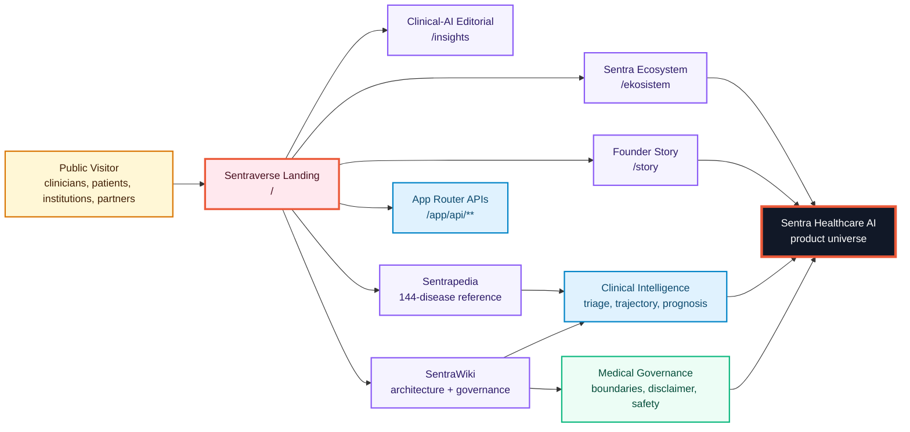
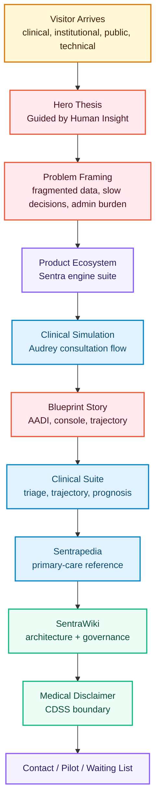
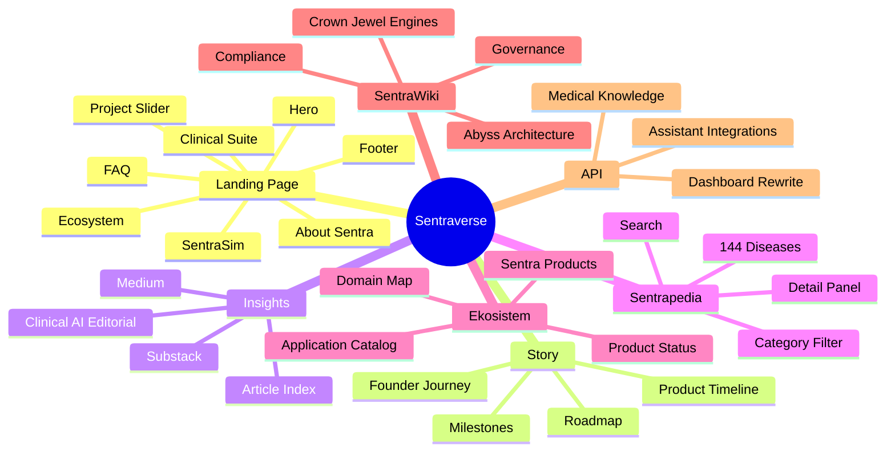
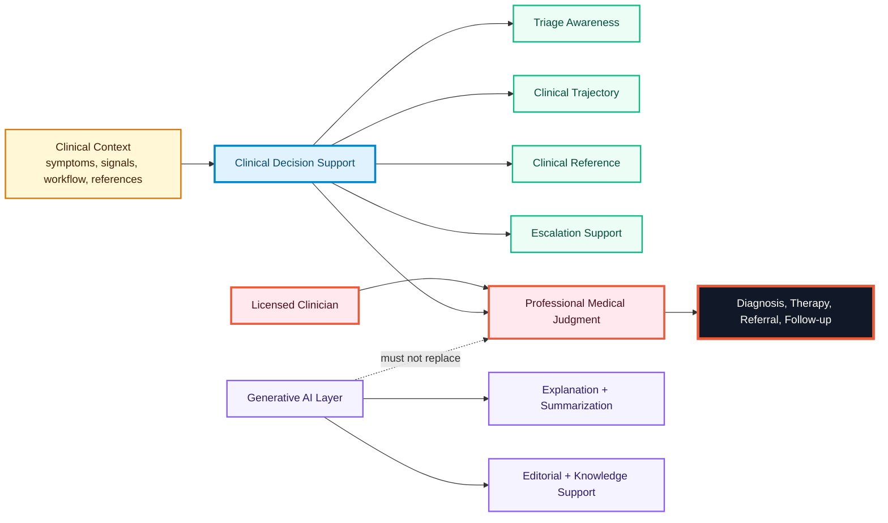
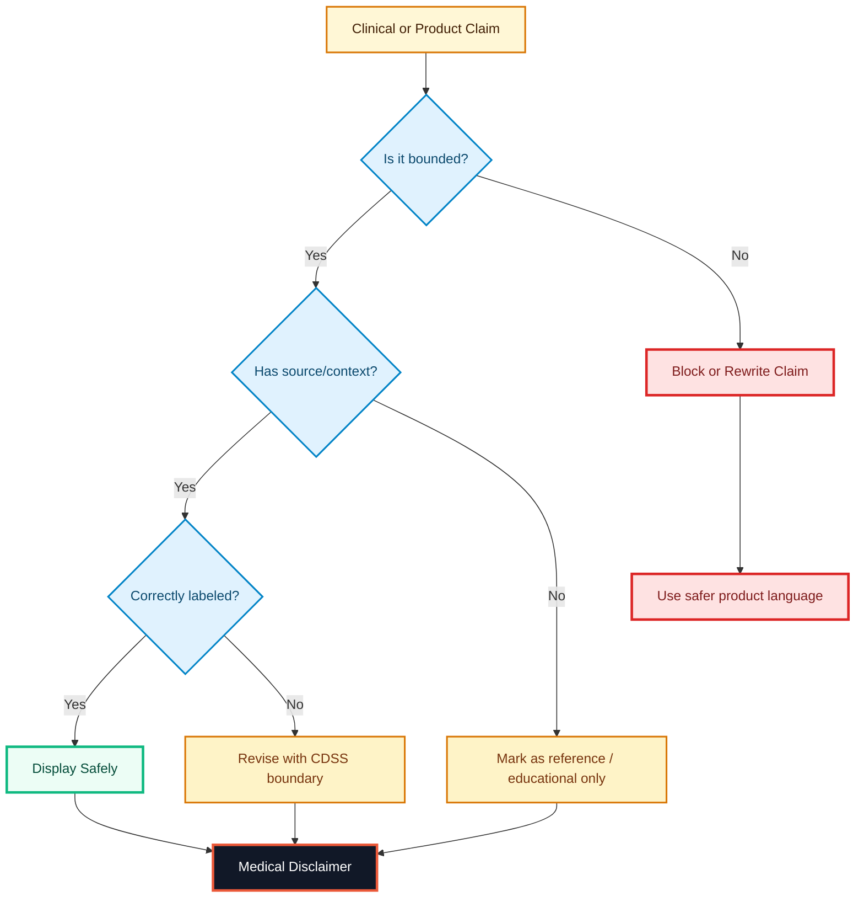
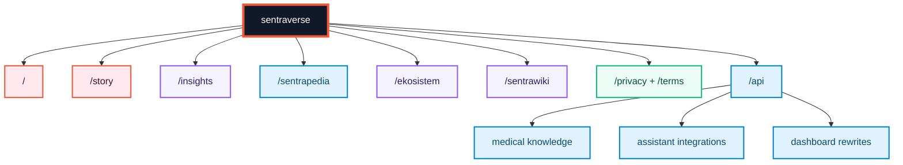
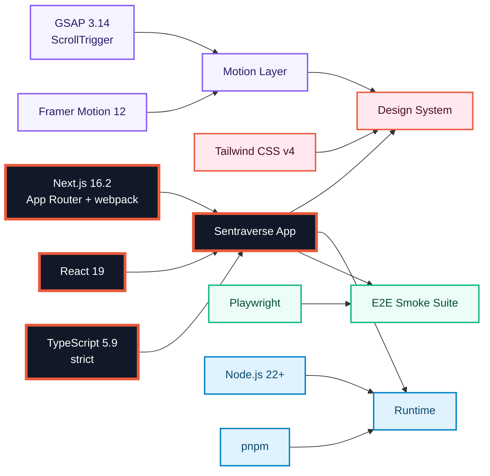
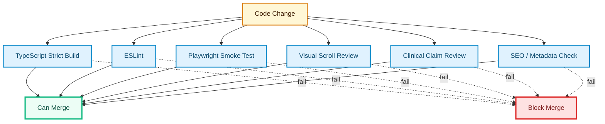

<div align="center">

<p>
  
</p>

### The official product universe of Sentra Healthcare AI

### Clinical intelligence for Indonesia’s frontline healthcare system

<p>
  
  
  
  
  
  
  
  
  
  
</p>

<p>
  <strong>Sentraverse</strong> is the official website, product narrative layer, and public knowledge surface for <strong>Sentra Healthcare AI</strong>.
  It translates clinical intelligence, founder vision, medical governance, product architecture, and Indonesian primary-care workflow into one coherent digital universe.
</p>

<p>
  <strong>Guided by Human Insight, Powered by Artificial Intelligence.</strong>
</p>

<p>
  <a href="https://sentrahai.com"><strong>Website</strong></a>
  ·
  <a href="#system-map"><strong>System Map</strong></a>
  ·
  <a href="#clinical-ai-boundary"><strong>Clinical Boundary</strong></a>
  ·
  <a href="#testing-and-governance"><strong>Governance</strong></a>
  ·
  <a href="#contact"><strong>Contact</strong></a>
</p>

</div>

---

## Executive Summary

**Sentraverse** is the official marketing, product, and knowledge hub for
**Sentra Healthcare AI**.

It is not a generic corporate website. It is the public trust layer for a
clinical-AI ecosystem designed for Indonesian primary care: **Puskesmas**,
**klinik pratama**, referral hospitals, clinicians, healthcare operators,
public-sector stakeholders, and technical partners.

Sentraverse connects six strategic surfaces inside one coherent website:

| Surface               | Route          | Function                                                 |
| --------------------- | -------------- | -------------------------------------------------------- |
| Clinical-AI Landing   | `/`            | Main product narrative and scroll-driven introduction    |
| Founder Story         | `/story`       | Founder journey, product milestones, and roadmap         |
| Clinical-AI Editorial | `/insights`    | Thought leadership and article index                     |
| Sentrapedia           | `/sentrapedia` | 144-disease primary-care clinical reference              |
| Sentra Ecosystem      | `/ekosistem`   | Product ecosystem and application catalog                |
| SentraWiki            | `/sentrawiki`  | Architecture, governance, compliance, and knowledge base |

The center of gravity is simple:

> Sentraverse explains why Sentra exists, how it supports clinical work, where
> its boundaries are, and why it matters for Indonesia’s frontline healthcare
> system.

---

## Product Thesis

> A clinical-AI product does not earn trust through animation alone. It earns
> trust by making its purpose, workflow, safety posture, and governance legible.

Sentraverse is built to answer four strategic questions:

| Strategic Question            | Sentraverse Answer                                                                                |
| ----------------------------- | ------------------------------------------------------------------------------------------------- |
| What is Sentra Healthcare AI? | A workflow-native clinical intelligence layer for Indonesian healthcare                           |
| Why does it matter?           | It reduces fragmented information, slow escalation, and administrative burden                     |
| How does the product think?   | Through triage intelligence, clinical trajectory, reference knowledge, and governed AI assistance |
| How is safety protected?      | By positioning Sentra as clinical decision support, not a replacement for licensed clinicians     |

---

## Sentra Design Language

Sentraverse follows the **Sentra Healthcare AI** design language: clinical,
editorial, architectural, precise, and memorable.

| Element         | Direction                                                                     |
| --------------- | ----------------------------------------------------------------------------- |
| Visual tone     | Dark editorial clinical command center                                        |
| Background      | Charcoal, warm ink, cream plates, and intentional high-contrast sections      |
| Accent          | Red-orange, Oxford blue, violet, amber, emerald, and sky                      |
| Typography      | Strong display headings, readable body copy, mono labels for system signals   |
| Component shape | Thin-border cards, clinical panels, tactical badges, product command surfaces |
| Motion          | Used for sequence, explanation, and orientation — never empty decoration      |
| AI posture      | Supports clinical reasoning; does not replace professional judgment           |
| Safety posture  | Clinical claims must remain bounded, transparent, and governed                |

---

## Table of Contents

- [Executive Summary](#executive-summary)
- [Product Thesis](#product-thesis)
- [Sentra Design Language](#sentra-design-language)
- [System Map](#system-map)
- [Experience Loop](#experience-loop)
- [Product Surfaces](#product-surfaces)
- [Homepage Topology](#homepage-topology)
- [Clinical-AI Boundary](#clinical-ai-boundary)
- [Medical Safety Model](#medical-safety-model)
- [Route Map](#route-map)
- [Architecture Folder Map](#architecture-folder-map)
- [Technology Stack](#technology-stack)
- [Design Tokens](#design-tokens)
- [Motion System](#motion-system)
- [Local Runbook](#local-runbook)
- [Environment Variables](#environment-variables)
- [Testing and Governance](#testing-and-governance)
- [SEO and Discoverability](#seo-and-discoverability)
- [Documentation](#documentation)
- [Most Important Files](#most-important-files)
- [Product Truth Principles](#product-truth-principles)
- [Medical Disclaimer](#medical-disclaimer)
- [License](#license)
- [Contact](#contact)

---

## System Map



---

## Experience Loop

Sentraverse is not a static homepage. It is a guided trust-building loop.



---

## Product Surfaces



---

## Homepage Topology

The landing page is rendered from `app/page.tsx` as a 15-section scroll-driven
editorial experience.

```mermaid
flowchart TB
    Page["Landing Page<br/>app/page.tsx"]

    Hero["Hero<br/>rotating keyword + Audrey card"]
    Slider["ProjectSlider<br/>clinical footage"]
    AboutSentra["AboutSentra<br/>platform introduction"]
    About["About<br/>manifesto + Asclepius clock"]
    Ecosystem["Ecosystem<br/>pinned product cards"]
    Clients["Clients<br/>technology + institution marks"]
    SentraSim["SentraSim<br/>clinical screen + terminal"]
    Interlude["Interlude<br/>visual breather"]
    Blueprint["BlueprintStory<br/>AADI + console + trajectory"]
    Showcase["Showcase<br/>agents + thinking stack"]
    Services["Services<br/>accordion"]
    ClinicalSuite["ClinicalSuite<br/>triage + trajectory + prognosis"]
    Gallery["ScrollGallery<br/>scroll-driven imagery"]
    FAQ["FAQ<br/>JSON-LD FAQPage"]
    Footer["Footer<br/>brand plate + disclaimer"]

    Page --> Hero
    Page --> Slider
    Page --> AboutSentra
    Page --> About
    Page --> Ecosystem
    Page --> Clients
    Page --> SentraSim
    Page --> Interlude
    Page --> Blueprint
    Page --> Showcase
    Page --> Services
    Page --> ClinicalSuite
    Page --> Gallery
    Page --> FAQ
    Page --> Footer

    classDef page fill:#111827,stroke:#EB5939,color:#FFFFFF,stroke-width:4px;
    classDef hero fill:#FFE8EE,stroke:#EB5939,color:#4A1020,stroke-width:3px;
    classDef product fill:#F5F3FF,stroke:#8B5CF6,color:#2D1B69,stroke-width:2px;
    classDef clinical fill:#E0F2FE,stroke:#0284C7,color:#0C4A6E,stroke-width:2px;
    classDef content fill:#FFF7D6,stroke:#D97706,color:#422006,stroke-width:2px;
    classDef governance fill:#ECFDF5,stroke:#10B981,color:#064E3B,stroke-width:2px;

    class Page page;
    class Hero,About,Footer hero;
    class Ecosystem,Showcase,Services product;
    class SentraSim,Blueprint,ClinicalSuite clinical;
    class Slider,AboutSentra,Clients,Interlude,Gallery content;
    class FAQ governance;
```



---

## Homepage Sections

|   # | Section          | Function                                                                                              |
| --: | ---------------- | ----------------------------------------------------------------------------------------------------- |
|   1 | `Hero`           | Rotating GSAP headline keyword, count-up metrics, 4-phase Audrey consultation card, ambient scan-line |
|   2 | `ProjectSlider`  | Full-bleed clinical footage and product atmosphere                                                    |
|   3 | `AboutSentra`    | Platform introduction and positioning                                                                 |
|   4 | `About`          | Manifesto section with light plate, GSAP draw-in rules, and Asclepius clock mark                      |
|   5 | `Ecosystem`      | Horizontally pinned product cards with GSAP scrub and typing subtitle                                 |
|   6 | `Clients`        | Technology and institution marks                                                                      |
|   7 | `SentraSim`      | Embedded clinical screen simulation with live code terminal                                           |
|   8 | `Interlude`      | Static visual breather between pinned sequences                                                       |
|   9 | `BlueprintStory` | Pinned multi-scene blueprint narrative covering AADI, console, and trajectory                         |
|  10 | `Showcase`       | Orchestration agents and thinking-stack terminal                                                      |
|  11 | `Services`       | Service accordion                                                                                     |
|  12 | `ClinicalSuite`  | Tabbed clinical workspace for triage, trajectory, and prognosis                                       |
|  13 | `ScrollGallery`  | Scroll-driven product and clinical imagery                                                            |
|  14 | `FAQ`            | 12-question FAQ section with two-column cream plate and JSON-LD FAQPage                               |
|  15 | `Footer`         | Acid-yellow brand plate with contact, waiting list, stewardship, and medical disclaimer               |

---

## Clinical-AI Boundary

Sentraverse must explain Sentra clearly without overstating clinical capability.



### Boundary Rules

| Layer               | Allowed                                                     | Not Allowed                                           |
| ------------------- | ----------------------------------------------------------- | ----------------------------------------------------- |
| Website             | Explain mission, workflow, product surfaces, and governance | Claim autonomous diagnosis or treatment               |
| Sentrapedia         | Provide structured clinical reference                       | Replace clinical examination                          |
| Clinical simulation | Demonstrate workflow and escalation logic                   | Pretend to be real patient management                 |
| AI explanation      | Clarify, summarize, and support comprehension               | Override licensed clinician judgment                  |
| Product claim       | State CDSS support role                                     | State medical-device equivalence without registration |

---

## Medical Safety Model



---

## Route Map

| Route          | Rendering   | Purpose                                                                |
| -------------- | ----------- | ---------------------------------------------------------------------- |
| `/`            | Static      | Landing page with 15-section scroll-driven product experience          |
| `/story`       | Static      | Founder story, product milestones, timeline, and roadmap               |
| `/insights`    | Static      | Clinical-AI editorial index                                            |
| `/sentrapedia` | Static      | 144-disease clinical reference for primary care                        |
| `/ekosistem`   | Static      | Sentra product ecosystem and application catalog                       |
| `/sentrawiki`  | Static      | Knowledge base, architecture, governance, and compliance               |
| `/privacy`     | Static      | Privacy policy                                                         |
| `/terms`       | Static      | Terms of use                                                           |
| `/api/*`       | Edge / Node | Supporting API routes for medical knowledge and assistant integrations |



---

## Architecture Folder Map

```text
sentraverse/
├── app/
│   ├── page.tsx               # Landing page — 15 sections
│   ├── layout.tsx             # Root layout, fonts, JSON-LD, SmoothScrollProvider
│   ├── globals.css            # Design tokens, scoped themes, keyframes
│   ├── story/                 # Founder and product story
│   ├── insights/              # Editorial index and article data
│   ├── sentrapedia/           # 144-disease clinical reference
│   ├── ekosistem/             # Product ecosystem catalog
│   ├── sentrawiki/            # Knowledge base with paper theme
│   ├── privacy/               # Privacy policy
│   ├── terms/                 # Terms of use
│   ├── api/                   # Supporting API routes
│   ├── sitemap.ts             # Dynamic sitemap
│   ├── robots.ts              # Robots convention
│   └── opengraph-image.tsx    # Generated OpenGraph image
│
├── components/
│   ├── *.tsx                  # Section components
│   ├── blueprint-story/       # Pinned blueprint scenes
│   ├── sentrasim/             # Simulation columns, code terminal, sequence
│   ├── sentrapedia/           # Disease dataset and helpers
│   ├── sentrawiki/            # Engine cards, engine graph, document library
│   ├── ekosistem/             # Product and application data
│   └── ui/                    # UI primitives
│
├── lib/
│   ├── design-governance.ts   # Layout and typography governance
│   ├── use-smooth-scroll.ts   # Custom lerp wheel-smoothing hook
│   ├── site-links.ts          # Internal link single source of truth
│   └── utils.ts               # cn() helper
│
├── docs/                      # Project documentation
├── e2e/                       # Playwright smoke tests
└── public/                    # Static assets
```

---

## Technology Stack

| Layer           | Technology                                 |
| --------------- | ------------------------------------------ |
| Framework       | Next.js 16.2, App Router, webpack          |
| Runtime UI      | React 19                                   |
| Language        | TypeScript 5.9, strict mode                |
| Styling         | Tailwind CSS v4 with `@theme`              |
| Animation       | GSAP 3.14, ScrollTrigger, Framer Motion 12 |
| Testing         | Playwright E2E smoke                       |
| Runtime         | Node.js 22+                                |
| Package manager | pnpm                                       |



---

## Design Tokens

Core design tokens are governed through:

- `app/globals.css`
- Tailwind CSS `@theme`
- `lib/design-governance.ts`

| Token              | Value               | Role                                    |
| ------------------ | ------------------- | --------------------------------------- |
| `--sentra-bg`      | `#1e1e1e`           | Permanent dark site background          |
| `--sentra-fg`      | `#b7ab98`           | Primary foreground ink                  |
| `--sentra-accent`  | `#eb5939`           | Sentra red-orange accent                |
| `--sentra-primary` | `#4a7bb5`           | Oxford blue lifted for dark readability |
| Paper scope        | `#f2ebe0 / #002147` | SentraWiki cream plate and navy ink     |
| Footer plate       | `#e9fb5b / #111111` | Acid-yellow brand anomaly               |

---

## Motion System

Sentraverse uses motion as a product explanation layer.

| Motion Pattern               | Purpose                                                |
| ---------------------------- | ------------------------------------------------------ |
| GSAP pinned sections         | Explain long-form product narrative                    |
| ScrollTrigger scrub          | Tie animation to user intent                           |
| Rotating hero keyword        | Communicate product scope quickly                      |
| Count-up metrics             | Create executive-level energy                          |
| Clinical simulation sequence | Show workflow without claiming real patient management |
| Framer Motion entrances      | Improve orientation and section rhythm                 |
| Reduced-motion support       | Respect accessibility preferences                      |

Implementation discipline:

- use `anticipatePin` for stable pinned transitions
- use `invalidateOnRefresh` for responsive recalculation
- avoid motion that hides information
- avoid autoplay clinical claims
- keep animation subordinate to product meaning

---

## Local Runbook

### Prerequisites

| Requirement | Version |
| ----------- | ------- |
| Node.js     | `>= 22` |
| pnpm        | `>= 9`  |

### Install

```bash
pnpm install
```

### Development

```bash
pnpm dev
```

Local server:

```text
http://localhost:3000
```

### Production

```bash
pnpm build
pnpm start
```

### Validation

```bash
pnpm lint
pnpm build
pnpm test:e2e
```

Execution notes:

- Use `pnpm`, not npm/yarn/bun.
- The site runs with zero required environment configuration.
- Production-facing changes should pass build, lint, and Playwright smoke
  validation.
- Scroll-driven sections require visual sanity checks after layout or animation
  changes.

---

## Environment Variables

All environment variables are optional.

| Variable                      | Scope  | Purpose                                                                                                                               |
| ----------------------------- | ------ | ------------------------------------------------------------------------------------------------------------------------------------- |
| `NEXT_PUBLIC_PILOT_LOGIN_URL` | Client | Target URL for the “Tes Pilot Login” CTA. Validated against an allow-list of `sentrahai.com` hosts and falls back to `/dashboard`.    |
| `SENTRA_DASHBOARD_URL`        | Server | When set, `next.config.mjs` rewrites `/dashboard/:path*` to that origin, allowing the marketing host to front the clinical dashboard. |

---

## Testing and Governance



### Required Validation

| Area               | Minimum Check                                                       |
| ------------------ | ------------------------------------------------------------------- |
| Type safety        | TypeScript strict build must pass                                   |
| Lint               | ESLint must pass                                                    |
| E2E                | Playwright smoke suite must pass                                    |
| Scroll experience  | GSAP pinned sections must remain stable                             |
| Accessibility      | Motion should respect reduced-motion preferences                    |
| Clinical language  | Claims must remain within CDSS boundary                             |
| Medical disclaimer | Disclaimer must remain visible and accurate                         |
| SEO                | Sitemap, robots, metadata, OpenGraph, and JSON-LD must remain valid |

---

## SEO and Discoverability

Sentraverse includes structured SEO and AI-discoverability support.

| Asset                      | Purpose                                      |
| -------------------------- | -------------------------------------------- |
| `app/sitemap.ts`           | Dynamic sitemap                              |
| `app/robots.ts`            | Robots convention and `/dashboard` exclusion |
| `app/opengraph-image.tsx`  | Generated OpenGraph image                    |
| JSON-LD Organization       | Identifies Sentra Healthcare AI              |
| JSON-LD Person             | Identifies founder profile                   |
| JSON-LD FAQPage            | Supports FAQ discoverability                 |
| `public/llms.txt`          | Context surface for AI crawlers              |
| Google Search Console file | Search verification                          |

---

## Documentation

| Document                    | Content                                        |
| --------------------------- | ---------------------------------------------- |
| `docs/README.md`            | Documentation index                            |
| `ARCHITECTURE.md`           | Architecture deep-dive                         |
| `docs/design-governance.md` | Spacing, typography, density, and layout rules |
| `docs/ai-governance.md`     | Clinical-AI governance principles              |
| `CHANGELOG.md`              | Release history                                |
| `CONTRIBUTING.md`           | Contribution workflow                          |
| `SECURITY.md`               | Security policy                                |

---

## Most Important Files

| File                           | Why It Matters                                        |
| ------------------------------ | ----------------------------------------------------- |
| `app/page.tsx`                 | Main landing page and 15-section composition          |
| `app/layout.tsx`               | Root layout, fonts, JSON-LD, and SmoothScrollProvider |
| `app/globals.css`              | Design tokens, scoped themes, keyframes               |
| `lib/design-governance.ts`     | Layout and typography governance                      |
| `lib/use-smooth-scroll.ts`     | Custom lerp wheel-smoothing hook                      |
| `lib/site-links.ts`            | Internal link single source of truth                  |
| `components/Hero.tsx`          | Main product thesis and first impression              |
| `components/Ecosystem.tsx`     | Horizontally pinned product ecosystem                 |
| `components/SentraSim.tsx`     | Embedded clinical screen simulation                   |
| `components/ClinicalSuite.tsx` | Triage, trajectory, and prognosis workspace           |
| `components/blueprint-story/*` | Pinned blueprint scenes                               |
| `components/sentrapedia/*`     | 144-disease clinical reference                        |
| `components/sentrawiki/*`      | Knowledge base, engine cards, and document library    |
| `components/ekosistem/*`       | Product and application catalog                       |

---

## Product Truth Principles

Sentraverse is intentionally governed by these rules:

1. **Clinical-AI must be explained without exaggeration.**
2. **Sentra is clinical decision support, not a doctor replacement.**
3. **The website must communicate workflow, not just aesthetics.**
4. **Every clinical claim must remain bounded and responsible.**
5. **Motion must clarify the product story, not distract from it.**
6. **Sentrapedia is reference support, not diagnosis automation.**
7. **SentraWiki is the architecture and governance anchor.**
8. **The ecosystem must feel integrated, not like disconnected products.**
9. **Trust is built through clarity, boundaries, and disciplined language.**
10. **The public surface must protect the seriousness of the clinical mission.**

---

## Medical Disclaimer

Sentra AI functions as a **clinical decision support system**.

It is designed to support clinical reasoning, triage awareness, workflow
acceleration, and timely escalation. It does **not** replace professional
medical judgment, licensed clinical responsibility, clinical examination,
diagnosis, therapy, referral decisions, or formal follow-up planning by
healthcare professionals.

Sentra AI is not registered as a medical device.

All diagnostic, therapeutic, referral, and follow-up decisions remain the full
responsibility of licensed medical professionals.

---

## License

ISC © 2026 **Sentra Healthcare Solutions**

---

## Contact

**dr. Ferdi Iskandar** Founder & CEO, Sentra Healthcare AI

<p>
  <a href="mailto:drferdiiskandar@sentrahai.com">
    
  </a>
  <a href="https://sentrahai.com">
    
  </a>
  
  
</p>

---

## Instrumentation

<p align="center">
  
  
  
  
  
  
  
  
  
  
</p>

---

<div align="center">

### Sentraverse

**The home of Sentra Healthcare AI.** **Clinical intelligence for Indonesia’s
frontline healthcare system.**

</div>
